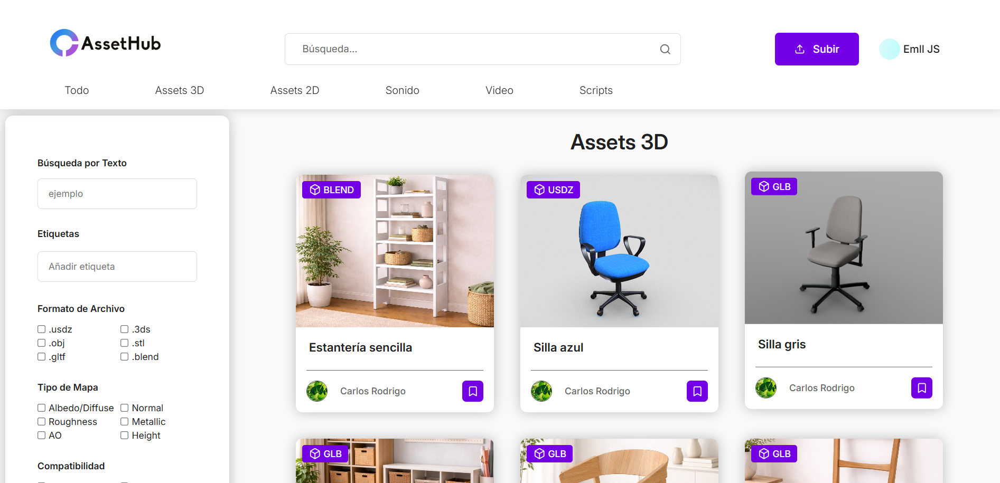
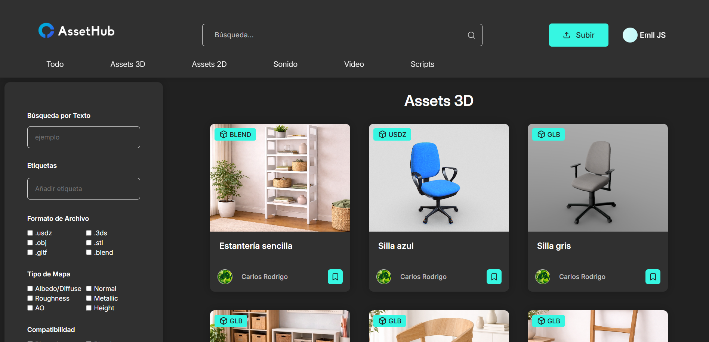
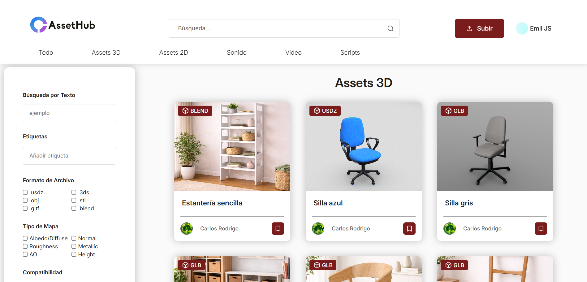
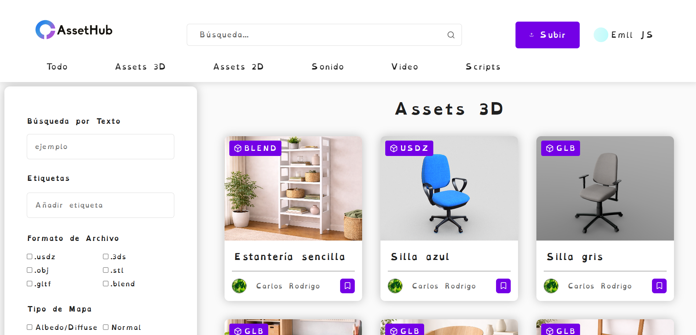

# 🏗️ Usabilidad y Accesibilidad 2025  

## Descripción

Una plataforma de almacenamiento y compartición de assets multimedia para la empresa ficticia MoLaMaZoGaMeS. La web admite subir recursos de 5 categorías:
- Assets 2D
- Assets 3D
- Audio
- Video
- Scripts 
Se pueden subir los formatos de archivo más comunes y ofrece potentes filtros de búsqueda adaptados a cada tipo de contenido. También permite la creación y de colecciones privadas para organizar el contenido del usuario.

## Tecnologías

Se ha usado el stack MERN para el desarrollo de este servicio:
- MongoDB como sistema de BD.
- Express.js para el backend.
- React.js para el frontend.
- Node.js como entorno de desarrollo.

## **Autores**

| Nombre y Apellidos | 
|--------|
| Emilia Rouanet Feliú | 
| Máximo Martínez Torres |
| Florian Dreschel |
| Tatsiana Karpiyevich |

## 📂 Estructura de la Base de Datos  

### **Usuario**  
| Campo | Descripción |
|--------|------------|
| `ID` | Identificador único |
| `Nombre` | Nombre del usuario |
| `Apellidos` | Apellidos del usuario |
| `Email` | Correo electrónico |
| `HashPassword` | Hash de la contraseña |
| `SaltPassword` | Salt para la contraseña |
| `FotoPerfil` | Base64 de la foto |

### **Ajustes**  
| Campo | Descripción |
|--------|------------|
| `UserID` | ID del usuario asociado |
| `Theme` | Tema visual (`0` = claro, `1` = oscuro, `2` = claro tritanopia) |
| `Font` | Tipo de fuente (`0` = normal, `1` = dislexia) |

### **Colecciones**  
| Campo | Descripción |
|--------|------------|
| `ID` | Identificador único |
| `Name` | Nombre de la colección |
| `Description` | Descripción de la colección |
| `UserID` | ID del usuario propietario |
| `Assets` | Assets dentro de la colección |
| `CreatedAt` | Fecha de creación |

### **Assets**    
| Campo            | Descripción                           |
|-------------------|---------------------------------------|
| `ID`             | Identificador único                  |
| `UsuarioID`      | ID del usuario propietario           |
| `Titulo`         | Título del asset                     |
| `Descripcion`    | Descripción del asset                |
| `Categoria`      | Categoría del asset                  |
| `Etiquetas`      | Lista de etiquetas asociadas         |
| `Compatibilidad` | Lista de compatibilidades del asset  |
| `Privado`        | Visibilidad del asset                |
| `Archivos`       | Archivos relacionados con el asset   |
| `Fotos`          | Fotos asociadas al asset             |
| `Fecha`          | Fecha de creación                    |
| `TotalArchivos`  | Número de archivos                   |
| `PesoTotal`      | Tamaño de los archivos               |

### **Comentarios**    
| Campo            | Descripción                          |
|-------------------|---------------------------------------|
| `ID`             | Identificador único                  |
| `UserID`         | ID del usuario propietario           |
| `AssetID`        | ID del asset relacionado             |
| `Text`           | Texto del comentario                 |
| `CreatedAt`      | Fecha de creación                    |

### **Me Gustas**    
| Campo            | Descripción                          |
|-------------------|---------------------------------------|
| `ID`             | Identificador único                  |
| `UsuarioID`      | ID del usuario propietario           |
| `AssetID`        | ID del asset relacionado             |

### **Descargas**    
| Campo            | Descripción                          |
|-------------------|---------------------------------------|
| `ID`             | Identificador único                  |
| `UsuarioID`      | ID del usuario propietario           |
| `AssetID`        | ID del asset descargado              |
| `Fecha`          | Fecha de descarga                    |

---

## 🔑 Pasos del Login  

### **Frontend**  
1️⃣ Se reciben los datos del formulario y se validan los campos.  
2️⃣ Se envían los datos al backend con la contraseña hasheada.  

### **Backend**  
3️⃣ Se vuelve a hashear la contraseña y se compara con la almacenada.  
4️⃣ Si la verificación es correcta, se devuelve un token JWT.  

### **Frontend**  
5️⃣ Se almacena el token en la sesión.  

---

## 📝 Pasos del Registro  

### **Frontend**  
1️⃣ Se reciben los datos del formulario y se validan los campos.  
2️⃣ Se envían los datos al backend con la contraseña hasheada.  

### **Backend**  
3️⃣ Se verifica si el email ya está registrado.  
4️⃣ Se genera un hash de la contraseña con su salt.  
5️⃣ Se almacena el usuario en la base de datos.  
6️⃣ Se genera un código de verificación para el email.  
7️⃣ Se almacena el código en la base de datos.  
8️⃣ Se devuelve la respuesta con el token JWT.  

### **Frontend**  
9️⃣ Se almacena el token en la sesión.  

---

## 📌 Rutas de Express  

### Autenticación y Usuario

| Ruta                        | Método | Descripción                                                                 |
|-----------------------------|--------|-----------------------------------------------------------------------------|
| `GET /user/`                | GET    | Token JWT. Obtener datos del usuario autenticado.                          |
| `GET /user/foto`            | GET    | Token JWT. Obtener foto del usuario autenticado.                           |
| `GET /user/settings`        | GET    | Token JWT. Obtener ajustes del usuario.                                    |
| `GET /user/descargas`       | GET    | Token JWT. Obtener historial de descargas del usuario.                     |
| `GET /user/:userid`         | GET    | Obtener datos de un usuario específico por ID.                             |
| `GET /user/foto/:userid`    | GET    | Obtener foto de un usuario específico por ID.                              |
| `POST /login`               | POST   | Iniciar sesión con email y contraseña.                                     |
| `POST /register`            | POST   | Crear una cuenta con datos.                                                |
| `POST /user/settings`       | POST   | Token JWT. Crear ajustes del usuario autenticado.                          |
| `PUT /user/`                | PUT    | Token JWT. Editar datos del usuario autenticado.                           |
| `PUT /user/settings`        | PUT    | Token JWT. Editar ajustes del usuario autenticado.                         |
| `DELETE /user/`             | DELETE | Token JWT. Eliminar el usuario autenticado.                                |

### Assets

| Ruta                                 | Método | Descripción                                                                 |
|--------------------------------------|--------|-----------------------------------------------------------------------------|
| `GET /assets/`                       | GET    | Token JWT (opcional). Obtener assets con filtrado.                         |
| `GET /assets/ultimos`                | GET    | Obtener los últimos 5 assets añadidos.                                     |
| `GET /assets/topLikes`              | GET    | Obtener los últimos 5 assets con más likes.                                |
| `GET /assets/:id/info`              | GET    | Token JWT (opcional). Obtener asset por ID.                                |
| `GET /assets/:id/descargar`         | GET    | Token JWT (opcional). Descargar archivos del asset como zip.               |
| `GET /assets/mis-assets`            | GET    | Token JWT. Obtener assets subidos por el usuario autenticado.             |
| `GET /assets/:userId`               | GET    | Token JWT. Obtener assets de un usuario.                                   |
| `POST /assets/`                     | POST   | Token JWT. Crear un nuevo asset.                                           |
| `POST /assets/archivos`             | POST   | Token JWT. Añadir archivos a un asset.                                     |
| `POST /assets/:id/visibilidad`      | POST   | Token JWT. Cambiar visibilidad de un asset.                                |
| `POST /assets/:id/fotos`            | POST   | Token JWT. Subir fotos a un asset.                                         |
| `PUT /assets/:id`                   | PUT    | Token JWT. Editar asset por ID.                                            |
| `DELETE /assets/:id`                | DELETE | Token JWT. Eliminar asset por ID.                                          |
| `DELETE /assets/:id/archivos/:archivoID` | DELETE | Token JWT. Eliminar archivo de un asset.                                   |
| `DELETE /assets/:id/fotos/:fotoId`  | DELETE | Token JWT. Eliminar foto de un asset.                                      |

### Colecciones

| Ruta                                          | Método | Descripción                                                                |
|-----------------------------------------------|--------|----------------------------------------------------------------------------|
| `GET /colecciones/mis-colecciones`            | GET    | Token JWT. Obtener colecciones del usuario.                               |
| `GET /colecciones/user/:userId`               | GET    | Obtener colecciones de un usuario por ID.                                 |
| `GET /colecciones/:id`                        | GET    | Obtener una colección por su ID.                                          |
| `POST /colecciones/`                          | POST   | Token JWT. Crear una colección.                                           |
| `POST /colecciones/:id/assets`                | POST   | Añadir un asset a una colección.                                          |
| `PUT /colecciones/:id/`                       | PUT    | Actualizar título y descripción de una colección.                         |
| `DELETE /colecciones/:id/assets/:assetId`     | DELETE | Token JWT. Borrar un asset de una colección.                              |
| `DELETE /colecciones/:id`                     | DELETE | Token JWT. Eliminar una colección del usuario.                            |

### Comentarios

| Ruta                                      | Método | Descripción                                                                 |
|-------------------------------------------|--------|-----------------------------------------------------------------------------|
| `GET /comentarios/asset/assetId`         | GET    | Token JWT (opcional). Obtener comentarios de un asset específico.         |
| `POST /comentarios/`                     | POST   | Token JWT. Crear un nuevo comentario.                                     |
| `PUT /comentarios/:id`                   | PUT    | Token JWT. Actualizar un comentario.                                      |
| `DELETE /comentarios/:id`                | DELETE | Token JWT. Eliminar un comentario.                                        |

### Me Gusta

| Ruta                                      | Método | Descripción                                                                 |
|-------------------------------------------|--------|-----------------------------------------------------------------------------|
| `GET /megustas/asset/:assetId`           | GET    | Token JWT (opcional). Obtener me gustas de un asset específico.           |
| `GET /megustas/user/:assetId`            | GET    | Token JWT. Obtener me gustas de un usuario y asset específico.            |
| `POST /megustas`                         | POST   | Token JWT. Crear un nuevo me gusta.                                       |
| `DELETE /megustas/`                      | DELETE | Token JWT. Eliminar un me gusta de un asset escrito por un usuario.       |

## 👁️ Modos de visualización

Este proyecto ha sido diseñado priorizando la accesibilidad y la usabilidad, 
incluyendo varios modos de visualización adaptados a diferentes necesidades y público.

### Modo Claro
Modo de visualización por defecto con fondo claro, texto oscuro y color acento morado.

### Modo Oscuro
Modo de visualización diseñado para reducir la fatiga visual en entornos con poca luz.

### Modo Tritanopia
La tritanopia es un tipo de daltonismo que dificulta la percepción de los colores azul y amarillo. 
En este modo, el color acento de la aplicación se sustituye por un rojo oscuro para mejorar la visibilidad.

### Modo Dislexia
Utiliza una tipografía especial diseñada para mejorar la legibilidad en personas con dislexia.

## Notas
Este servicio se desarrolló como proyecto final de la asignatura **Usabilidad y Accesibilidad** en el grado de **Ingeniería Multimedia** de la Universidad de Alicante. 